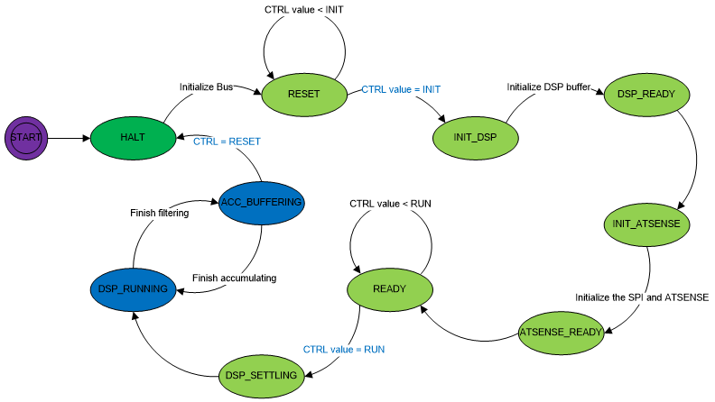

# DRV_METROLOGY_GetState Function

## C

```c
DRV_METROLOGY_STATE DRV_METROLOGY_GetState (void);
```

## Summary

Get the status of the metrology library application running on the second processor. 

## Description

Metrology function state:
  - 0 = HALT: Metrology module is halted;
  - 1 = RESET: Resetting metrology module; 
  - 2 = INIT_DSP: Initializing DSP filters;
  - 3 = DSP_READY: DSP filters have been initialized;
  - 4 = INIT_ATSENSE: Initializing ATSENSE;
  - 5 = ATSENSE_READY: ATSENSE has been initialized;
  - 6 = READY: ATSENSE temperature configuration & calibration data has been copied into output registers;
  - 7 = DSP_SETTLING: waiting for DSP filters to stabilize to full accuracy;
  - 8 = DSP_RUNNING: DSP filters have stabilized to full accuracy;

You can refer to the metrology state diagram for more detailed description:

  

## Parameters

None.

## Returns

Returns the metrology state.

## Example

```c
    case APP_METROLOGY_STATE_START:
    {
        if (DRV_METROLOGY_GetState() == DRV_METROLOGY_STATE_READY)
        {
            if (DRV_METROLOGY_Start() == DRV_METROLOGY_SUCCESS)
            {
                app_metrologyData.state = APP_METROLOGY_STATE_RUNNING;
            }
            else
            {
                app_metrologyData.state = APP_METROLOGY_STATE_ERROR;
            }

            vTaskDelay(10 / portTICK_PERIOD_MS);
        }

        break;
    }
```

## Remarks

None.

