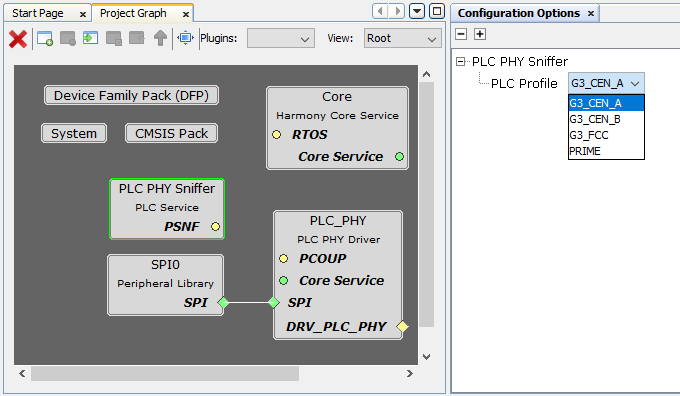

# Configuring The Library

PLC PHY Sniffer Service is configured via MCC. Below is the Snapshot of the MCC configuration window for PLC PHY Sniffer Service and brief description.

 

**PLC Profile**
Specifies the PLC Profile and/or Working band used. Available options are:

- PRIME. Shared profile for all channels, channel is later configured.
- G3 CEN-A. G3 Profile for Cenelec-A band.
- G3 CEN-B. G3 Profile for Cenelec-B band.
- G3 FCC. G3 Profile for FCC band.

*Note: As PLC PHY Sniffer Service is tightly linked to PLC PHY or MAC RT Driver, if PLC Profile is changed in PHY / MAC RT Driver Configuration, PHY Sniffer configuration is automatically updated to match the Profile selected in Driver.*
