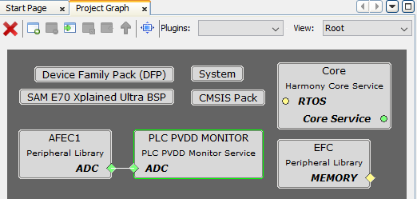
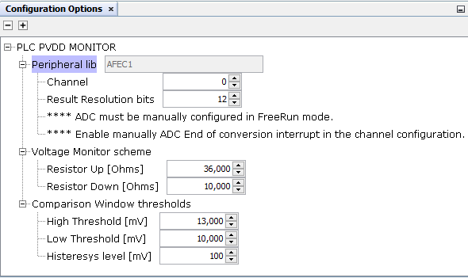
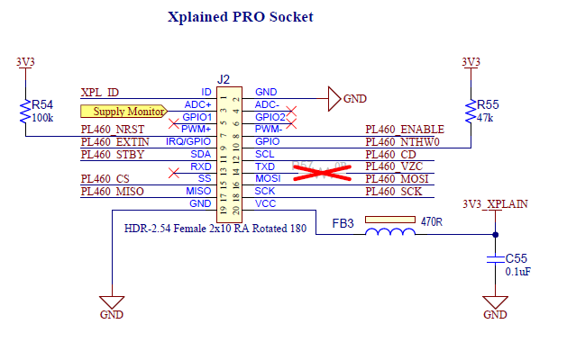
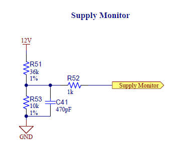
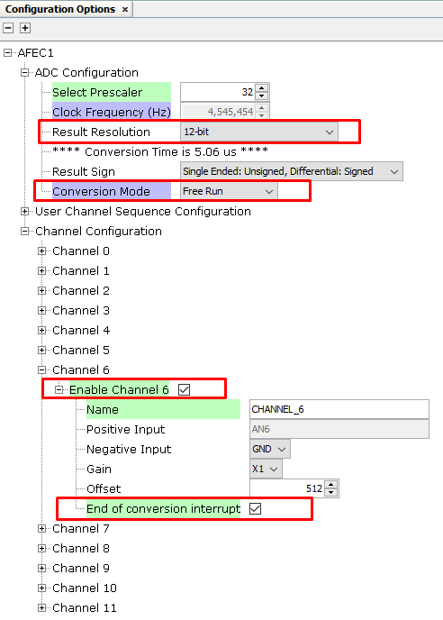

# Configuring The Library

**PVDD Monitor Service Specific User Configurations**

PVDD Monitor Service library should be configured via MCC. Below is the Snapshot of the MCC configuration window for PVDD Monitor Service and brief description.

 

 

- **Peripheral lib:**
    - Indicates the ADC peripheral instance used by the PVDD Monitor Service.
    - The name of the peripheral will vary from device to device.

    - **Channel:**
        - ADC channel to use with PVDD Monitor Service according to the HW board design.
        - PL460 Evaluation Kit has been designed to provide a Supply Monitor pin through the Xplained PRO connector.
         
        - This Supply Monitor pin should be connected to the ADC peripheral, so that connection determines what ADC channel should be used.

    - **Result Resolution bits:**
        - ADC conversion resolution.

- **Voltage Monitor hardware configuration:**
    - PL460-EK evaluation kit includes a specific circuit to monitor VDD voltage.
     
    - **Resistor Up:**
        - Value in ohms of the HW resistor connected to VDD. In case of PL460-EK, it is R51.
    - **Resistor Down:**
        - Value in ohms of the HW resistor connected to GND. In case of PL460-EK, it is R53.

- **Comparison Window thresholds:**
    - Threshold values to configure the comparison window of the PVDD Monitor service.
        - **High Threshold:**
            - The PLC transmission shall not take place when the PVDD level is above the high threshold value.
        - **Low Threshold:**
            - The PLC transmission shall not take place when the PVDD level is under the low threshold value.
    

**ADC Configurations**

- There are some configuration values which must be adjusted manually in ADC PLIB configuration options to match the values configured in PVDD Monitor service. These configuration values are the following:
    - Result Resolution.
    - Conversion mode must be configured manually in FreeRun mode.
    - Enable the proper channel according to the board HW design.
    - ADC End of conversion interrupt must be enable manually.

