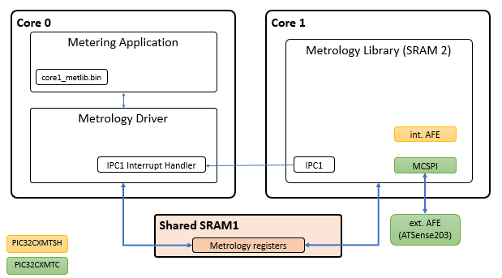
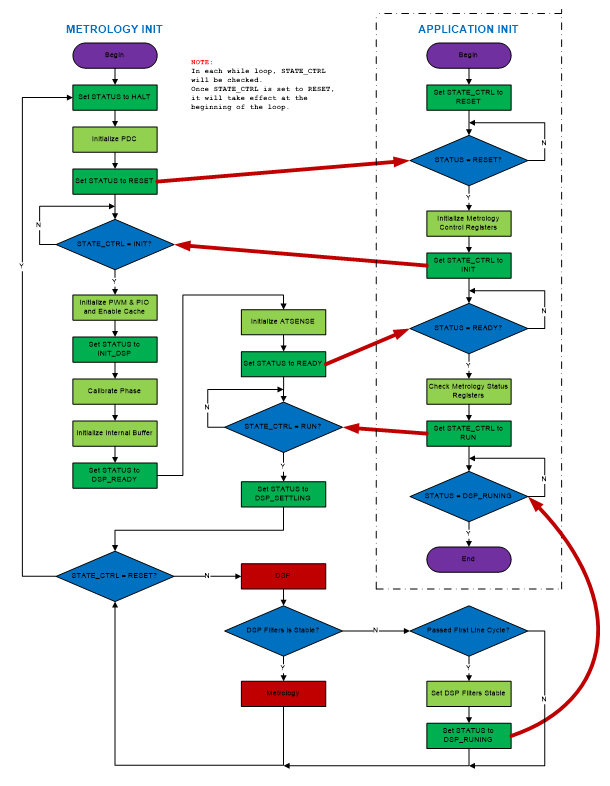

# How the Metrology driver library works

This driver has been designed to be only used with PIC32CXMTSH or PIC32CXMTC devices, which are parts of the MISTRAL (PIC32CXMT) device family of the Smart Energy group.

Depending on which device is used, there are some requirements to be considered:

- **PIC32CXMTSH connection**
  - This device supports single phase and dual phase (2 voltages and 2 currents).
  - AFE is internally provided.
  
- **PIC32CXMTC connection**
  - This device supports poly-phase.
  - It requires an external AFE, ATSense203.

The Energy Metering AFE collects the data from current sensors and voltage inputs and digitizes voltage and current data. This data is processed by the Metrology library, running on the Core 1 of the PIC32CXMTSH/C microcontroller. The Metrology driver and metering application run on Core 0.



## Initialization process

After a power up, the metrology driver is responsible of the following points:

- Initialize and configure IPC (Inter-Processor communication) peripheral.
- Initialize the interface with the metrology library via shared memory.
- If the reset cause of the main processor was not a Watchdog reset:
  - Control reset lines of the coprocessor (second processor) and the peripherals driven by the coprocessor.
  - Control clock lines of the coprocessor (second processor) and the peripherals driven by the coprocessor.
  - Copy the metrology library application file to the coprocessor execution memory.

A watchdog reset detection is needed in order to avoid any interruption source of the metrology library application from the main processor.

The metrology driver provides an assembly file to include the metrology library application file into the application of the main processor:

```c
  .section .rodata
  .global met_bin_start
  .global met_bin_end

  .align 8
met_bin_start:
  .incbin "./core1_metlib.bin"
  .align 8
met_bin_end:
```

A couple of variables are created in order to set the start and end address where the metrology library file can be found in the main application.

```c
extern uint8_t met_bin_start;
extern uint8_t met_bin_end;

/* Metrology Driver Initialization Data */
DRV_METROLOGY_INIT drvMetrologyInitData = {

    /* MET bin destination address */
    .regBaseAddress = DRV_METROLOGY_REG_BASE_ADDRESS,

    /* MET Binary start address */
    .binStartAddress = (uint32_t)&met_bin_start,
    
    /* MET Binary end address */
    .binEndAddress = (uint32_t)&met_bin_end,
    
};
```

Once the metrology library has been located in the main application, the metrology driver is in charge of copying its content in the execution memory of the coprocessor.

Once the metrology driver has been initialized, it is necessary to call to opening function which is responsible of enabling IPC peripheral and waiting until metrology library application has been started. At this point, metrology control registers are configured and state control data is set to INIT status.



At this point, start function should be called by the main application until the metrology library is in READY status. When it happens, the metrology driver sets the state control data to RUN status and the IPC integration interrupt will be triggered after every integration period.

When an integration period interrupt has been triggered by the metrology library application, a callback function will be used to notify this event to the main application. When it happens, the update measurements function should be called to obtain the RMS values and all the metrology events properly.
