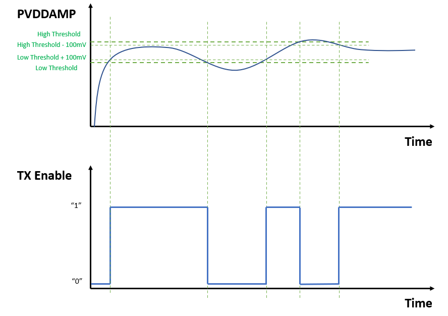

# How the Library Works

To assure the integrity of the amplification stage embedded in the PL460 device, the PVDD Monitor service implements a window comparator in which the power supply of PLC driver amplifier and regulators (PVDDAMP) is monitored via ADC PLIB. 

If this voltage is outside the allowed thresholds, PLC transmission must not be performed as it could destroy the output stage of the PLC driver amplifier. To enable PLC transmission, act on the TX Enable pin of the PL460.

Hysteresis thresholding has been implemented by taking a fixed value of 100mV as a reference.
