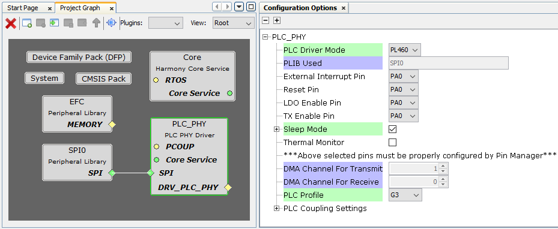
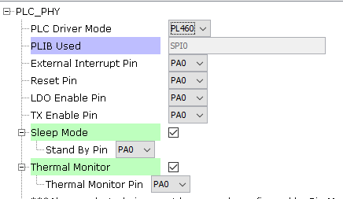
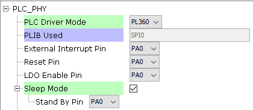
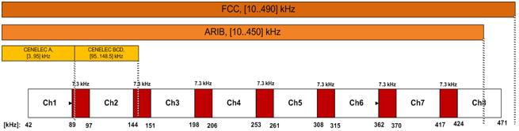
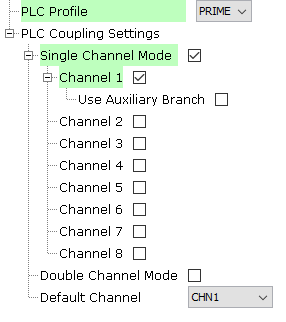
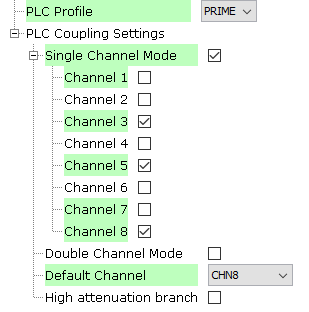
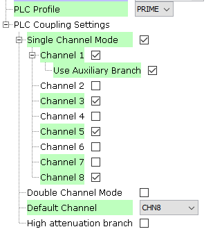
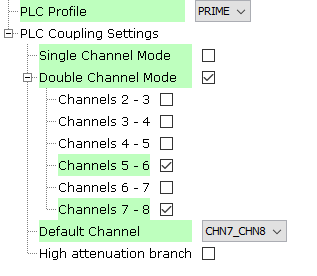

# Configuring The Library

**PLC PHY Driver Specific User Configurations**

PLC PHY Driver library should be configured via MCC. Below is the Snapshot of the MCC configuration window for PLC PHY driver and brief description.

 

- **Phy Driver Mode Used:**
    - Specifies the PLC device physically connected.
    - The pins in use will vary depending on the device selected.
    
    - **Configuration for PL460 device**
        
         

    - **Configuration for PL360 device**
        
        

- **Phy Driver Peripheral Used:**
    - Indicates the SPI peripheral instance used by the PLC PHY driver.
    - The name of the peripheral will vary from device to device.

- **Phy Driver External Interrupt Pin Used:**
    - GPIO Pin to be used as external interrupt interface (active low)
    - This pin automatically indicates that the firmware running in the PLC device has one or more pending events to be consulted. 
    - This pin must be configured as GPIO input in "Pin Settings" configuration. Set Pull Down configuration.
     
    
        

- **Phy Driver Reset Pin Used:**
    - GPIO Pin to be used as reset (active low).
    - This pin must be configured as GPIO output in "Pin Settings" configuration.
    - This pin resets the core and the peripherals of the PLC device.

- **Phy Driver LDO Enable Pin Used:**
    - GPIO Pin to be used as LDO enable (active high).
    - This pin must be configured as GPIO output in "Pin Settings" configuration.
    - This pin provides power to the core voltage regulator embedded in the PLC device.

- **Phy Driver TX Enable Pin Used (PL460 mode):**
    - GPIO Pin to allow PLC transmissions (active high).
    - This pin must be configured as GPIO output in "Pin Settings" configuration.

- **Enable Sleep Mode:**
    - In Sleep mode, the core of the device and the peripherals are reset reducing power consumption.

    - **Phy Driver Standby Pin Used:**
        - GPIO Pin to be used as sleep mode enable (active high).
        - This pin must be configured as GPIO output in "Pin Settings" configuration.

- **Enable Thermal Monitor (PL460 mode):**
    - Enable Thermal Monitor interface.

    - **Phy Driver Thermal Monitor Pin Used (PL460 mode):**
        - GPIO Pin to check the status of the Thermal monitor
        - This pin must be configured as GPIO output in "Pin Settings" configuration.

- **PLC Profile:**
    - This Option can be used to select the PLC standard to comply with such as ITU G.9903 (G3-PLC) or ITU G.9904 (PRIME).

- **PLC Coupling Settings:**
    - PLC Driver mode must have been selected before to obtain a valid PLC coupling settings for each mode.
    - Used to establish the hardware configuration associated to the PLC frequency bands to use.
    - The options of this configuration will vary from the selected PLC profile.

    - **G3 profile:**
        - The configuration will vary depending on the PLC Driver Mode selected.
        - **PL460:**
            - **Main Branch:**

                
                - The main transmission branch uses the embedded class-D PLC line driver to optimize performance in terms of efficiency and EMC compliance while reducing BOM cost and PCB complexity.
                - This is the default branch for single-band applications either in CEN-A, CEN-B or FCC bands.
            
                
                            

                - **FCC high attenuation branch:**
                    - This option is visible only for FCC configured as the main branch.
                    - The PL460 is capable of automatically managing two external filters in the filtering stage, each filter associated to an ASOx line.
            - **Multiband:**
             
                
                - This option is visible only for FCC as main branch.
                - Used to select CEN-A or CEN-B as the auxiliary PLC phy band.
                - **Auxiliary Branch:**
                    - The Auxiliary Transmission Branch can provide an additional output bit-stream, if required.
                    - The Auxiliary Transmission path cannot use the embedded PLC driver in the PL460 and requires an external circuit for signal amplification, in addition to the standard filtering and coupling stages.
                - **Set as default branch:**
                    - Used to establish Auxiliary branch in the intialization of the PHY PLC driver.
        - **PL360:**
            - **Main Branch:**
            
                
                - This is the default branch for single-band applications either in CEN-A, CEN-B or FCC bands.
                - **FCC high attenuation branch:**
                    - This option is visible only for FCC configured as the main branch
            - **Internal Driver:**
                - This option is visible only for PL360 driver mode, G3 profile and CEN-B configured as the main branch
            
                

                - In case of using a coupling with internal driver, only one branch is allowed and all the four EMIT pins must be connected to the same point and transmission control is indicated by TXRX0.
            - **Multiband:**
            
                
                - This option is visible only for FCC as main branch.
                - Used to select CEN-A or CEN-B as the auxiliary PLC phy band
                - **Auxiliary Branch:**
                    - The Auxiliary Transmission Branch can provide an additional output bit-stream, if required.
                - **Set as default branch:**
                    - Used to establish Auxiliary branch in the intialization of the PHY PLC driver.
    - **PRIME profile:**
        
        
        - PHY PLC driver can handle several communications channels, the user can configure which set of channels the PLC device is allowed to operate on.
        - **Single Channel**
        
            - PLC frames will be transmitted using 1-channel frequency range.
            - **Channel "i"**
                - Enable Channel "i" to be used for a PLC frame.
            - Hardware configuration will vary depending on the selected configuration
                - **Channel 1 using the main branch**
                     
                    
                - **Channel from 3 to 8 using the main branch**
                     
                    
                - **Multiband using the auxiliary branch**
                     
                    
        - **Double Channel**
    
            - PLC frames will be transmitted using 2-channel frequency range.
            - **Channel "i - j"**
                - Enable Channels "i" and "j" to be used for a PLC frame.
            - This mode is only available for using the main branch.
            
            
                    
        - **Default Channel**
            - Used to establish the channel by default in which the PLC Driver is configured to transmit and receive.
        - **High attenuation branch**
            - This option is visible only for PL460 and it takes effect in the main branch.
            - The PL460 is capable of automatically managing two external filters in the filtering stage, each filter associated to an ASOx line.

**NVIC Configurations**

- The PLC Phy driver has a strong dependency on a delay function defined in the HAL module. This delay function is called from the PIO Handler associated with the External Interrupt pin. 
- Applications designed in MCHP used as PLC examples use the Timer module as the delay interface, so the priority of the Timer interrupt must be higher that the rest of interrupts in order to ensure the correct operation.
